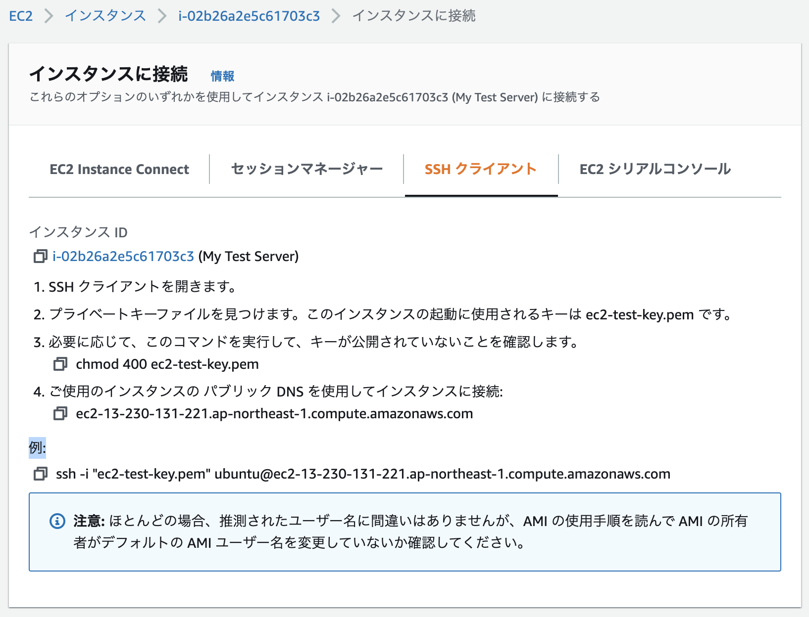
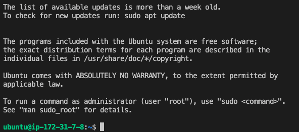

# 1. Login EC2 by ssh

## 1. はじめに
EC2インスタンスを起動して、SSHを使用してEC2にログインします。

## 2. インスタンスを作成する
AWSのサービス検索窓から「EC2」を検索し、「インスタンスを起動」ページへ移動します。

### インスタンスを起動
1. 以下の内容でEC2インスタンスを作成します。


```
名前とタグ：My Test Server
インスタンスタイプ:
- アプリケーションおよびOSイメージ：Ubuntu
- Amazonマシンイメージ： Ubuntu Server 22.04 LTS (64bit) 
- インスタンスタイプ：t2.micro
キーペア：「新しいキーペアを作成」から「ec2-test-key」という名前で作成
- キーペアのタイプ：RSA
- プライベートキーファイル形式：.pem
ネットワーク設定：
- ネットワーク：vpc-xxxxxxx(デフォルトを仕様)
- サブネット：優先順位なし (アベイラビリティーゾーンのデフォルトサブネット)
- パブリックIPの自動割り当て：有効化
ファイアウォール
- 「セキュリティグループを作成する」で「からのSSHトラフィックを許可する」にチェックを入れ、任意の場所「0.0.0.0/0」を設定する
ストレージ、高度な詳細はデフォルトのままにする
```

2. 「インスタンスを起動」を押し、インスタンスの内容を確認する

サイドメニューからインスタンス一覧を確認し、「実行中」のステータスになっていれば成功です。

インスタンスIDをクリックすると概要が確認できます。 
パブリックIPv4DNSアドレスをメモしておく(例「ec2-13-230-131-xxx.ap-northeast-1.compute.amazonaws.com」)

また、「接続」から「SSHクライアント」タブに移動し、sshコマンドをメモしておいてください。

 

```
例:
ssh -i "ec2-test-key.pem" ubuntu@ec2-13-230-131-221.ap-northeast-1.compute.amazonaws.com
```

1. 作成したキーペア「ec2-test-key.pem」を.sshに移動する

```
mv ~/path/ec2-test-key.pem ~/.ssh
chmod 400 ~/.ssh/ec2-test-key.pem
```

4. sshでEC2に接続する

```
ssh -i ~/.ssh/ec2-test-key.pem [ec2-username]@[ec2-xx-xxx-xxx-xxx.ap-northeast-1.compute.amazonaws.com]
```

例:
```
ssh -i ~/.ssh/ec2-test-key.pem ubuntu@ubuntu@ec2-13-230-131-221.ap-northeast-1.compute.amazonaws.com
```

5. 下記のようにubuntuに入れれば成功
```
ubuntu@ip-172-31-7-8:~$ 
```

 

### (Option: インスタンスを削除)
**「2.APIをbuildする」へ進む場合は削除しないでください**

インスタンス一覧から削除対象のインスタンスにチェックを入れ、「インスタンスの状態」から「インスタンスを終了」をクリックして削除します。
 
