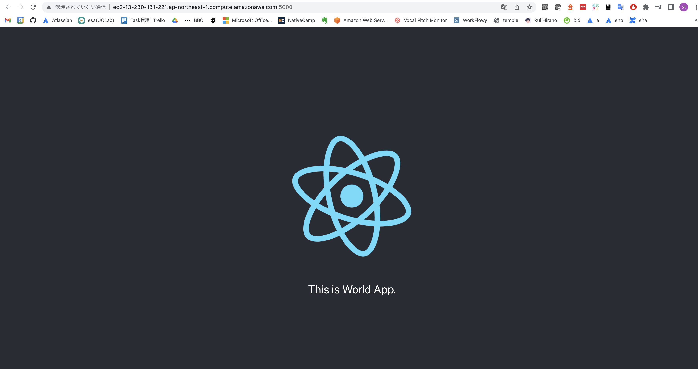
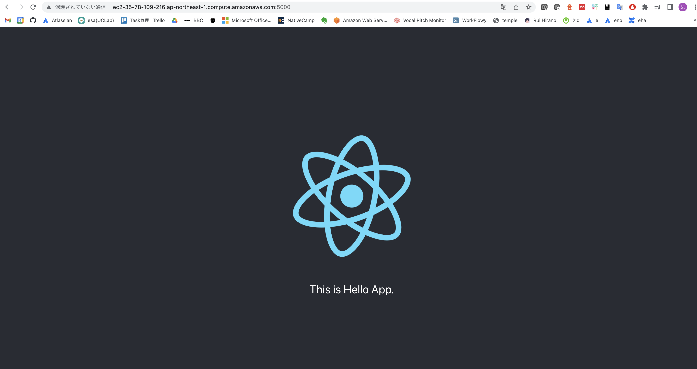
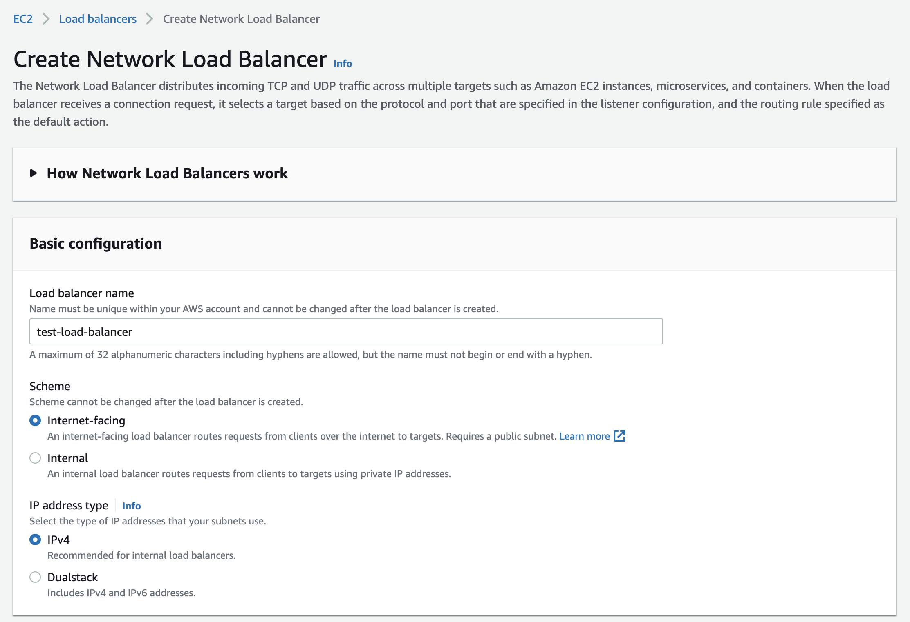
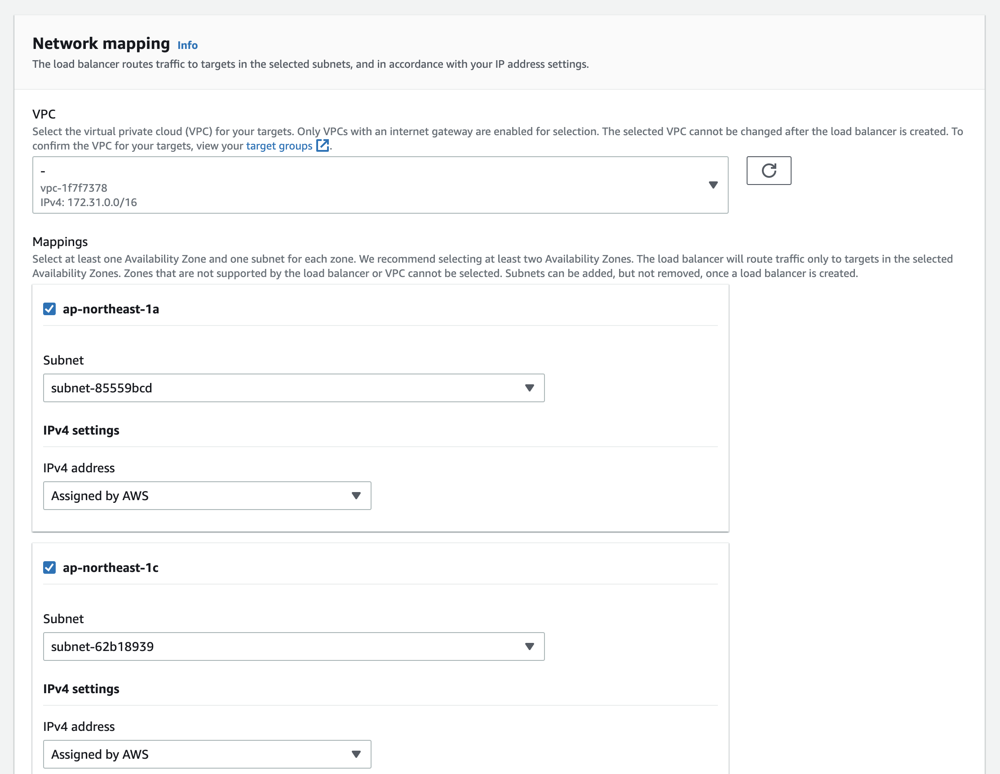
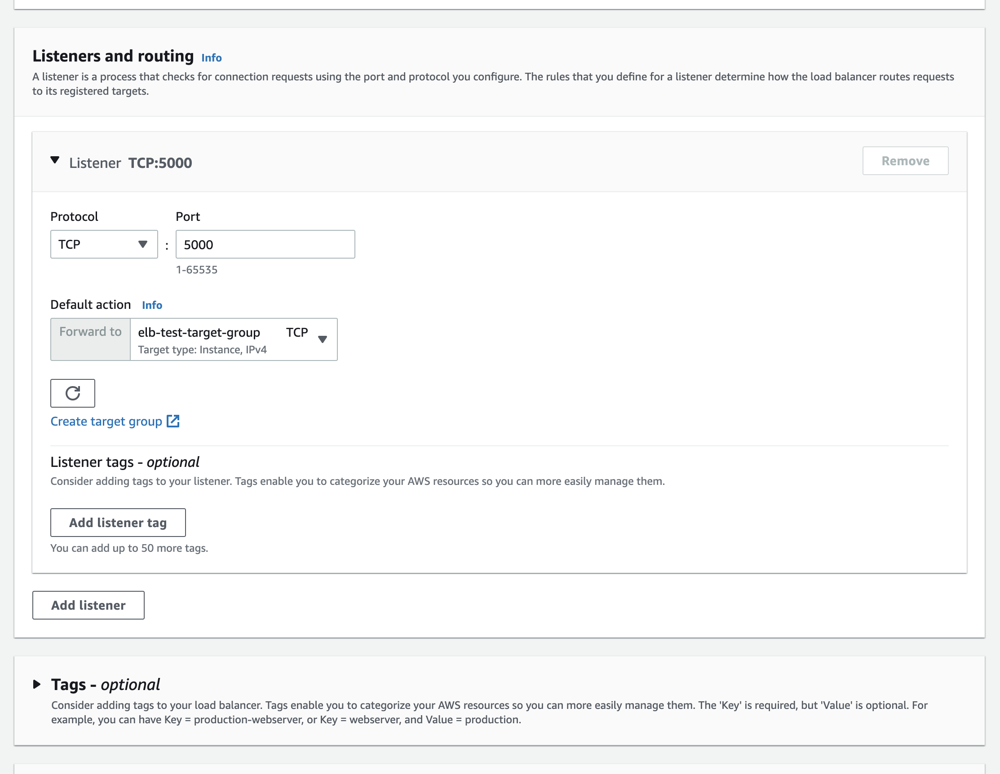
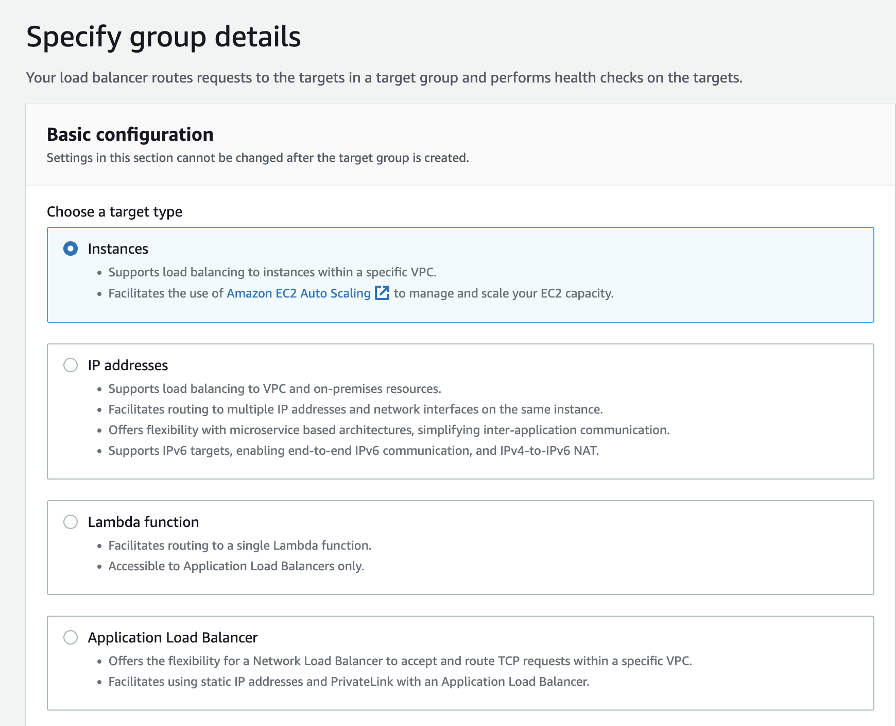
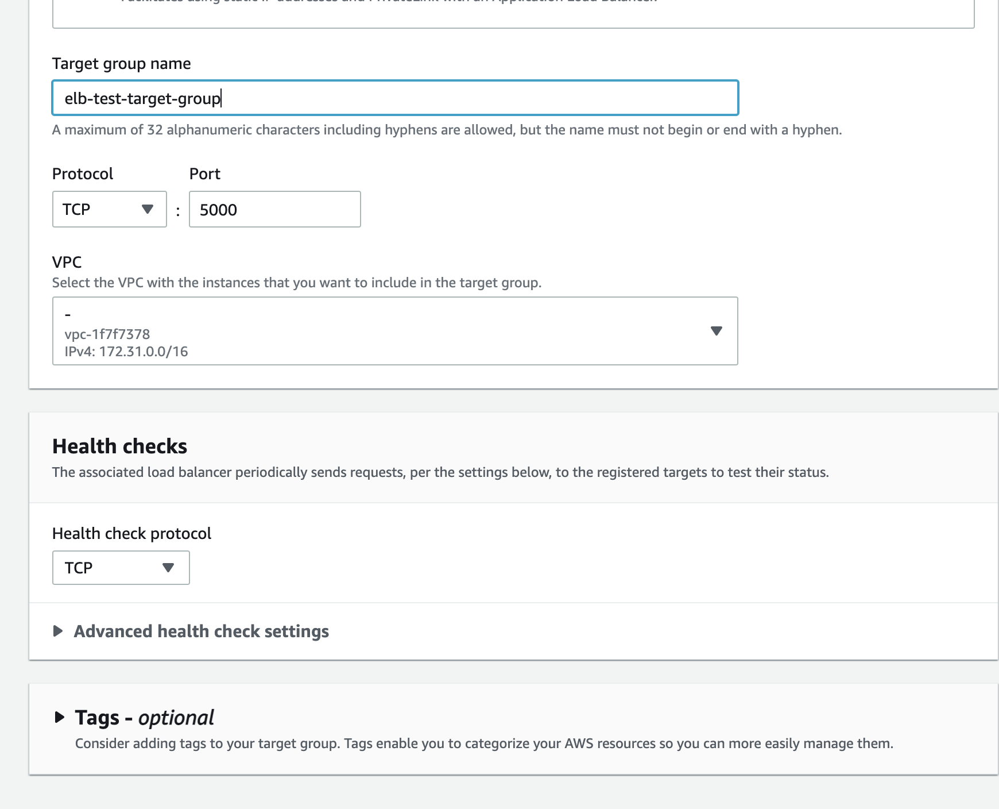
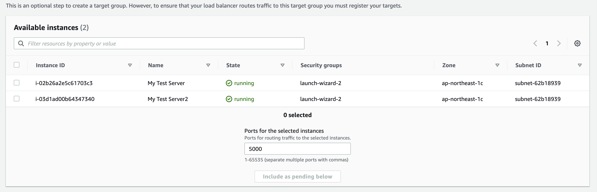
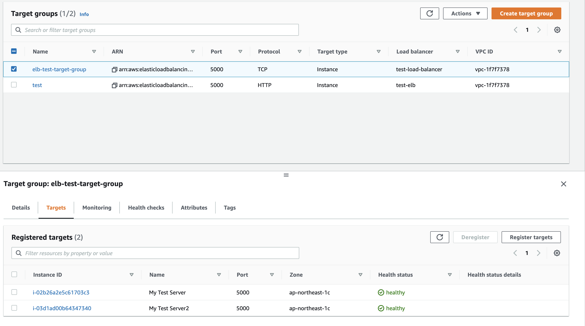
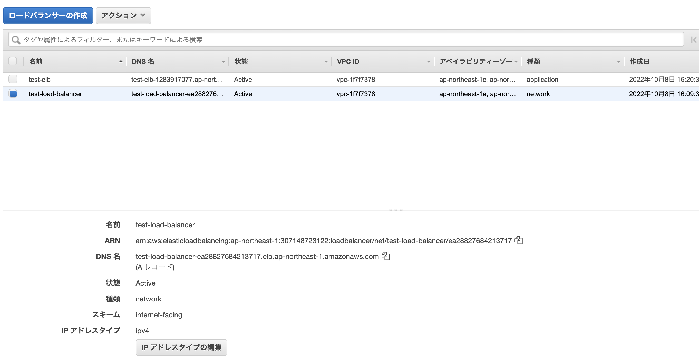

# 3. Build Elastic Load Balancing

## はじめに
本記事ではReactで作成されたUIを２つのインスタンスで立ち上げ、ロードバランシング(ELB)を実装していきます。

## 1. インスタンスをもう一つ立ち上げる

**1.login_ec2_by_ssh**で行った手順に従いインスタンスをもう一つ立ち上げてください。
その際、名前を「My Test Server2」とし、「My Test Server」と同じキーペア(ec2-test-key)を使用し、セキュリティグループも同じものを選択してください。

## 2. frontendを立ち上げる
二つのEC2内で異なるWebサーバーを5000ポートで起動します。

My Test Server
```
$ cd aws-learning-textbook/ec2/frontend
$ python3 -m http.server 5000 --directory build
```
ブラウザからEC2ホストの5000ポートを確認します。
「http://ec2-13-230-xxx-xxx.ap-northeast-1.compute.amazonaws.com:5000/」
「This is World App」と表示されれば成功です。
 

My Test Server2
```
$ cd aws-learning-textbook/ec2/frontend
$ python3 -m http.server 5000 --directory build2
```
「This is Hello App」と表示されれば成功です。
 

## 3. ELBの設定
AWSのEC2サービス画面のサイドバーから「ロードバランサー」画面に移動してください。
「ロードバランサーの作成」から「Network Load Balancer」を選択します。


> **Note**
> ロードバランサータイプの主な違い
> | 種類  | 説明  |
> | --- | --- |
> | Application Load Balancer  | HTTP・HTTPSプロトコルのレイヤー７（アプリケーション層）に対応する単一ロードバランサーです。  |
> | Network Load Balancer  | TCPやUDPのレイヤー4（トランスポート層）で動作して、リクエストの内容に基づいてターゲットにルーティングする |
> | Gateway Load Balancer  | レイヤー3（ネットワーク層）で動作します。ファイアウォール、侵入検知および防止システム、ディープパケットインスペクションシステムといったサードパーティのセキュリティ製品などをAWS上で利用する場合、従来に比べシンプルかつ容易に、スケール、可用性、サービス提供のしやすさを向上させることができます。  |
> 参考：[公式ドキュメント: ロードバランサーの種類](https://docs.aws.amazon.com/ja_jp/AmazonECS/latest/developerguide/load-balancer-types.html)


ロードバランサー名は「test-load-balancer」とします。
 

続いてNetwork mappingでは「ap-northeast-1a」と「ap-northeast1c」の二つにチェックをいれます。
 

Listeners and routingでelbのターゲットグループを作成する必要があります。これはこれはサブネット内のどのインスタンスをターゲットとするかを決めるグループです。
 

### ターゲットグループの作成
ターゲットタイプとして「Instances」を選択する。
 

Target group nameは「elb-test-target-group」とする。
TCP：5000を設定し「Next」を押す。
 

Available Instancesで作成したインスタンス二つにチェックマークを入れ作成する。
 

「Include as pending below」を押し、画面下部に二つのインスタンスがリスト表示されているのを確認してから作成完了すること。

ターゲットグループの作成後、Load balancer作成時にそのターゲットグループを指定してLoad Balancerを作成します。

## 3. Load balancer経由でサイトを閲覧する

ターゲットグループでhealthy checkを確認します。
 


ロードバランサー画面からDNS名をメモしておきます。
 

ブラウザから[Load balancer DNS]:5000にアクセスして、Webサイトが表示されるか確認してください。

更新するに従い「This is Hello App.」と「This is World App.」が交互に表示されればロードバランシングが成功しています。
 

# トラブルシューティング
## 1. リロードするとたまに白画面になる

TODO
```
GET http://test-load-balancer-ea28827684213717.elb.ap-northeast-1.amazonaws.com:5000/static/js/main.382027c4.js net::ERR_ABORTED 404 (File not found)
```
