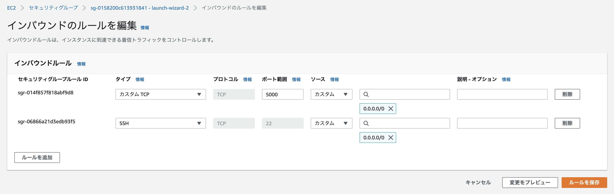

# 3. Build Elastic Load Balancing

## はじめに
本記事ではReactで作成されたUIを２つのインスタンスで立ち上げ、ロードバランシング(ELB)を実装していきます。

## 1. インスタンスをもう一つ立ち上げる

**1.login_ec2_by_ssh**で行った手順に従いインスタンスをもう一つ立ち上げてください。
その際、名前を「My Test Server2」とし、「My Test Server」と同じキーペア(ec2-test-key)を使用し、セキュリティグループも同じものを選択してください。

## 2. frontendを立ち上げる
二つのEC2内で異なる環境変数をつけてWebサーバーを5000ポートで起動します。
この環境変数はロードバランシングの際にどちらのWebサーバーを見ているかを判断するIDとなります。

```
$ cd aws-learning-textbook/ec2/frontend
$ REACT_APP_SERVER="Hello" 
```

### 内部からcurlして通信を確認する
```
$ curl localhost:5000
Hello World
$ curl localhost:5000/good
Good
```

### 外部からcurlして通信を確認する

```
$ curl 13.230.xxx.xxx:5000
$ curl ec2-13-230-xxx-xxx.ap-northeast-1.compute.amazonaws.com:5000
curl: (7) Failed to connect to 13.230.xxx.xxx port 5000: Operation timed out

```
何も表示されず通信できていないことを確認します。
これはEC2のセキュリティグループで外部からのhttp,https通信が許可されていないため起きています。

## 2. セキュリティグループでHTTP/HTTPSを許可する

セキュリティグループは外部とのネットワーク接続の許可を決定するファイアウォールのようなものです。
ここではAPIサーバーがポート5000で立ち上がっているため、カスタムTCPでポート5000として保存します。

 

## 3. curlでAPIに接続できるか確認する
ipアドレスとDNS名のどちらでも接続できることを確認します
```
$ curl 13.230.131.221:5000
Hello World% 
$ curl ec2-13-230-131-221.ap-northeast-1.compute.amazonaws.com:5000
Hello World%     
```

Hello worldと返って来れば成功です。

## トラブルシューティング(httpで接続できない場合)

### 1. pingで接続確認

接続できていない場合：
```
$ ping ec2-13-230-131-221.ap-northeast-1.compute.amazonaws.com     
PING ec2-13-230-131-221.ap-northeast-1.compute.amazonaws.com (13.230.131.221): 56 data bytes
Request timeout for icmp_seq 0
Request timeout for icmp_seq 1
Request timeout for icmp_seq 2
...
```

接続できている場合：
```
$ ping 13.230.131.221
PING 13.230.131.221 (13.230.131.221): 56 data bytes
Request timeout for icmp_seq 0
64 bytes from 13.230.131.221: icmp_seq=1 ttl=43 time=20.777 ms
64 bytes from 13.230.131.221: icmp_seq=2 ttl=43 time=31.653 ms
```

### 2. AWSドキュメントを確認する

以下のAWSトラブルシューティングに従い、サブネットやファイアウォールなどを確認する。
https://aws.amazon.com/jp/premiumsupport/knowledge-center/ec2-connect-internet-gateway/

- C2 インスタンスが前提条件をすべて満たしていることを確認します。
- インスタンスにパブリック IP アドレスがあることを確認します。
- ファイアウォールがアクセスをブロックしていないことを確認します。

### 3. firewallの無効化
```
$ systemctl status ufw
$ sudo ufw status
$ sudo ufw disable
```
